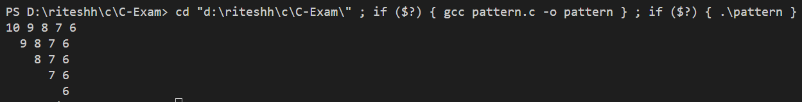
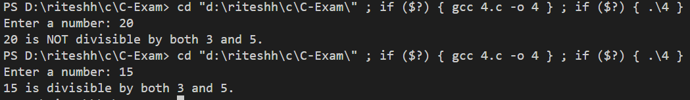
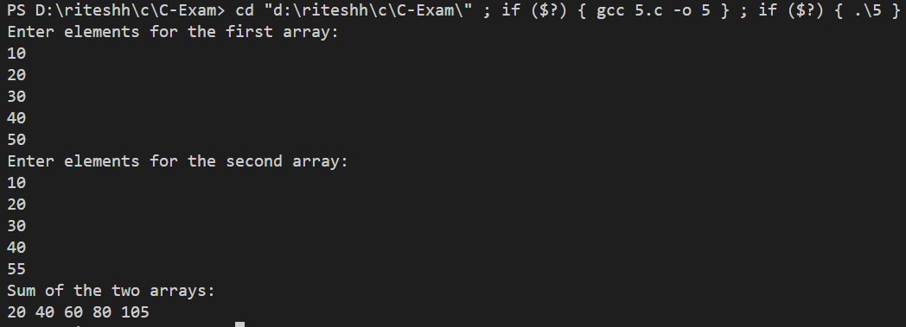
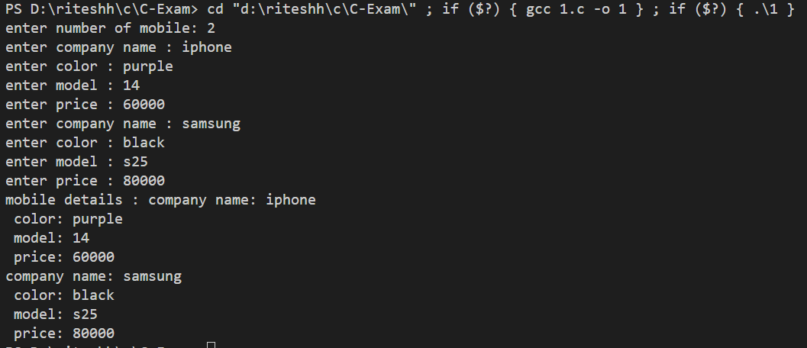

## exam questions outputs : 

# Write a C program that prompts the user to enter a 3 digit's positive integer. Find the sum of first and last digit.

# Implement a C program to print the following pattern using nested for loop:

# Create a C program that defines a function to check if a given number is divisible by 3 and 5 both or not.

# Write a C program that uses pointers to find the sum of two 1D arrays.

# Develop a C program that uses a structure to represent a mobile (with attributes like company_name, color, model, and price). List N number of mobiles' details using Array of objects.

